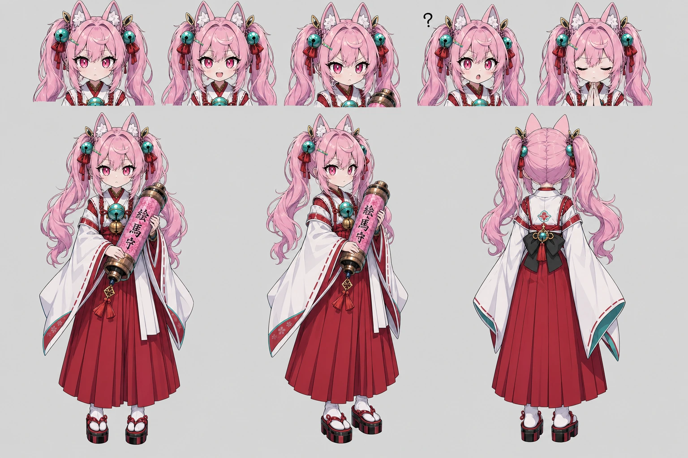

<div align="center">


# 言灵神社 · Kotodama Shrine

### 一款叙事驱动的和风冒险游戏 · LLM 实时判定言灵感应

<p>一天黄昏，言灵走进了一座古老的神社。神社里住着四位居民——慈祥的老奶奶、沉默的老爷爷、内向的长女、好奇的次女。他们各自做着寻常事，仿佛一切如常。然而看似平静的对话之下，隐隐流淌着一丝不安——一位孩子的失手，将引发一场祸事。只有言灵——只有你——能从字里行间察觉到即将降临的灾难。你说的话，将影响他们的命运。</p>

<p><b>核心命题：「言语是介质，从这里流向那里。」</b></p>

<p>
  <a href="https://game.yangtzeu.work/"><b>在线体验</b></a>
  &nbsp;·&nbsp;
  <a href="#快速开始"><b>本地启动</b></a>
  &nbsp;·&nbsp;
  <a href="#玩法"><b>玩法</b></a>
  &nbsp;·&nbsp;
  <a href="#技术栈"><b>技术栈</b></a>
  &nbsp;·&nbsp;
  <a href="#素材生成流程"><b>素材生成</b></a>
  &nbsp;·&nbsp;
  <a href="docs/endings.md"><b>结局机制</b></a>
  &nbsp;·&nbsp;
  <a href="https://jcni7q9d8n2t.feishu.cn/docx/M5XNdiJdioIjtgx3XV5c1ZPpnBd"><b>设计文档</b></a>
</p>

<sub>Made for 抖音 AI 创变者比赛 · 2026</sub>

<sub>React 18 + Vite + TypeScript · LLM via OpenAI-compatible API · Local-first · MIT</sub>

</div>

---

## 你扮演谁

玩家扮演**言灵**——徘徊于神社的神使，狐耳、神使衣袍。你不是被选中的英雄，而是「一种在场的方式」。你恰好走到这座神社前，走进了他们的黄昏。你的话语会在这个空间里产生回响，但它如何影响他们，取决于他们自己。

---

## 玩法

### 场景自由移动
言灵在神社的整个场景中自由移动——庭院、本殿、手水舍、鸟居小径、后山的社务所。不是固定机位，走到哪里，故事就发生在哪里。WASD / 方向键 / 手机摇杆。

### 四位神社居民

| NPC | 身份 | 工程 id |
|---|---|---|
| 老奶奶 | 神社的守护者，长年在这里打扫、供奉 | `obaa-san` |
| 老爷爷 | 沉默寡言的神社管理人，负责修缮 | `shokunin` |
| 长女 | 内向安静，对妹妹很是关注 | `miko-shrine` |
| 次女 | 好奇心旺盛，喜欢到处乱跑 | `warabe` |

### 对话系统
走近任一 NPC 按 E / 点击触发对话。NPC 主动说出包含灾难线索的话；玩家自由文本回应，LLM 同时生成 2–4 个建议回复供快速选择。每次发送，LLM 输出结构化 JSON `{ reply, kotodama_triggered, kotodama_phrase, kotodama_action }`，「言灵感知」由模型按严格条件实时判定（详见下文「言灵判定机制」）。

对话不是一次性的——同一位 NPC 会有新对话。当黄昏逐渐加深，不安的氛围愈加浓厚。

### 4 个结局

开放式叙事，不是写在纸上的几种，而是从对话中自然生长出来的一片光谱。当前 MVP 落地 4 个：

- **BAD END · 沉默** —— 巫女背影走过鸟居参道，雾合拢
- **NORMAL END · 错过** —— 雨夜山道，绣樱花的小包袱坠在崖边
- **TRUE END · 修复** —— 神社室内暖灯，姐妹在镜前并肩，爷爷在旁修镜
- **HIDDEN END · 守望** —— 神社夜景，玩家化为言灵驻守鸟居一侧

解锁的结局会在 CG 鉴赏页解锁；音乐鉴赏页用电影感播放器播放游戏内 BGM。完整文案 + 触发条件 + 工程映射见 [`docs/endings.md`](docs/endings.md)。

---

## 技术栈

| 层 | 选型 | 说明 |
|---|---|---|
| 前端 | React 18 + Vite + TypeScript | SPA，路由 react-router 7，状态 Zustand |
| LLM | OpenAI-compatible 任意网关 | 默认 OpenRouter 配置；可换 DeepSeek / OpenAI / 自建 |
| 后端 | Node http 单文件 132 行 | `api/server.mjs`，做 LLM 代理 + JSON 兼容 + 错误消化 |
| 素材 | GPT-Image-2 + Seedance 2.0 | 详见下文 |
| 部署 | 默认本地 `npm run dev:all` | 无需服务器，浏览器打开 `localhost:5173` 即玩 |

---

## 快速开始

### 1. 克隆 + 装依赖

```bash
git clone <this-repo> kotodama-shrine
cd kotodama-shrine
npm install
```

### 2. 配 LLM key

```bash
cp .env.example .env.local
# 用编辑器把 your_api_key_here 替换成你的真实 key
```

支持任意 OpenAI 兼容接口。三个变量名都识别，优先级 `DEEPSEEK_API_KEY` > `OPENROUTER_API_KEY` > `OPENAI_API_KEY`。

默认 `.env.example` 走 OpenRouter（[openrouter.ai](https://openrouter.ai)），模型 `poolside/laguna-xs.2:free`。换 provider 改 `OPENAI_COMPAT_BASE_URL` + `OPENAI_COMPAT_MODEL` 即可。

### 3. 启动本地一切

```bash
npm run dev:all
```

会同时起：
- `localhost:8787` — API 代理（`api/server.mjs`，负责把前端调用转发给上游 LLM，把 key 留在后端）
- `localhost:5173` — Vite dev server（前端），通过 `/api` proxy 到 8787

浏览器打开 `localhost:5173`，进游戏。

### 4. 想 build 本地静态

```bash
npm run build
# 产物在 dist/，配合任意静态服务即可
```

不需要任何云服务器。

---

## 项目结构

```
kotodama-shrine/
├── api/
│   └── server.mjs              132 行 Node http，LLM 代理 + dotenv 加载
├── public/
│   ├── kotodama_bg.png         主场景背景（GPT-Image-2 生成）
│   ├── characters → images/    角色立绘 symlink
│   ├── cutouts/                前景遮挡剪影
│   ├── scene/                  intro.mp4 (Seedance) + 碰撞 / 遮挡 JSON
│   ├── ui/cg/                  4 张结局 CG（GPT-Image-2）
│   └── ui/menu/                主菜单 / 按钮 webp（GPT-Image-2）
├── images/                     角色 sprite sheet（GPT-Image-2 + 切帧）
├── src/
│   ├── pages/                  MainMenu / Home / CgGallery / MusicGallery / NpcEditor
│   ├── components/             character / chat / dialog / ending / intro / audio / mobile / ui
│   ├── data/personas/          4 个 NPC 的人设 md（warabe / miko-shrine / obaa-san / shokunin）
│   ├── lib/npcChat.ts          LLM 调用 + JSON 解析 + 言灵判定
│   ├── lib/endingFlags.ts      结局解锁状态（localStorage）
│   └── lib/npcStateStore.ts    全局对话计数 / 言灵触发状态
├── docs/endings.md             4 个结局的文案 / 触发 / 工程映射
├── scripts/
│   ├── dev-all.mjs             并起 api + web
│   └── validate-dialogue.mjs   人设 / 文案校验
└── tools/scene-bbox/           场景标注 / 切图工具 Python 脚本
```

---

## 素材生成流程

### 角色立绘 / 动作序列帧

两阶段：

1. **人设大图** —— GPT-Image-2 出一张高质量人设（正/侧/背 + 表情合集），作为后续所有动作的视觉锚

   

2. **动作序列帧** —— 走 Codex CLI 的 `hatch-pet` skill：把人设大图作为 reference，让模型按动作清单（idle / walk-front / walk-back / walk-left / walk-right）生成每帧静态图 + 自动拼装成 sprite sheet，并导出预览 gif 校验循环帧自然度

产物存在 `images/main/miko/`（巫女多状态）和 `images/npc/<id>/`（NPC 默认只用 idle）。前者按状态分目录 + 编号 `<state>/<NN>.png`，后者 `<id>_idle_NN.png`。

四位 NPC（按交互优先级）：

- **若叶 · 童子（warabe）** —— 妹妹，粉色双马尾 + 狐耳 + 巫女装，主推动剧情的人
- **神社老妪（obaa-san）** —— 奶奶，沉默寡言知道家史
- **工匠（shokunin）** —— 爷爷，修镜手最稳
- **神社巫女 · 见习（miko-shrine）** —— 姐姐，二十出头压着角色责任

### CG 与场景背景

全部 GPT-Image-2 生成。背景 `kotodama_bg.png` 是 6.1MB 高分辨率原图，4 张 ending CG（bad / normal / true / hidden）放 `public/ui/cg/`。

### 美术风格

- **类型**：2D 横向卷轴手绘，类似精美视觉小说的场景呈现
- **色调节奏**：黄昏暖橙 / 琥珀色 → 暮色深蓝紫 → 火灾场景橙红剪影
- **建筑**：日式传统神社，灰瓦、白壁、木格窗、注连绳
- **植被**：樱花（粉白）/ 松树（深绿）/ 青草（嫩绿）/ 苔藓（墨绿）四层绿意交错
- **氛围弧**：前期宁静温柔，适合驻足与聆听 → 中期隐隐不安，灯笼孤光摇曳 → 结局以火光与夜色形成强烈视觉冲击

### 过场动画

Seedance 2.0，**双输入**：

1. **参考人设图** —— 把上文角色立绘段的 [`assets/character-sheet-warabe.webp`](assets/character-sheet-warabe.webp) 作为角色参考喂给 Seedance，锁住角色外观（双马尾粉发 + 狐耳 + 樱花发饰 + 巫女装 + 青绿铃铛 + 绘马卷轴），避免文生视频自由发挥导致角色漂移
2. **场景 / 动作 / 镜头 / 风格 prompt**：

```
夜晚的神社庭院，深紫色的天空有几缕薄云缓缓流动，
一位粉色长双马尾、白色狐耳带樱花发饰的小巫女，
穿白色巫女上衣和深红色袴，胸前挂着青绿色铃铛，
双手抱着粉色绘马卷轴，从画面右上方那座发着粉光的朱红鸟居下，
缓步走出，沿着青石阶一阶一阶往下走，
木屐踩在石板上发出轻响，每一步都让石板溅起一点点樱花花瓣，
长发被夜风从右后方轻吹，发丝一缕一缕地分开飘动，
红色袴的褶皱随脚步起伏，宽袖的内里被风掀起一线红边，
铃铛随着她的步伐轻晃，发出细微的金属共鸣，
四盏石灯笼里的青蓝色光焰从微弱到明亮，像呼吸一样脉动，
神社主殿内的暖橙色灯光从纸窗里透出来，与灯笼的青蓝在地面拼成一条冷暖交叠的光带，
两只石狛犬被光从下往上打亮，影子拉长投在背后的木墙上，
樱花从画面左上和右下两个方向飘落，有几片擦过她的肩膀和发梢，
镜头从远景慢慢推近，从俯视微微下沉到与她平视，
最后停在她走到狛犬之间、抬眼望向神社门内灯光的瞬间，
京都动画风格，赛璐璐手绘动画，细腻的二维光影层次，
柔和的电影感色彩，温柔安静的夜晚氛围
```

输出 `public/scene/intro.mp4`，开场和 IntroOverlay 衔接。

### 文案 / 人设 prompt

直接走 Codex CLI 迭代，每个 NPC 的 persona md 大约写到 4–6 屏。秘密层 / 关系层 / 颜文字风格列表 / 标志性短句都直接进 system prompt。

---

## 言灵判定机制（核心设计）

每个 NPC 的 system prompt = `src/data/personas/<id>.md` + 全局 `MECHANICS` 段（在 `src/lib/npcChat.ts`）。

MECHANICS 告诉 LLM：

1. 今夜灾难背景（妹妹今晚走山道，会塌方）
2. 「言灵感知」3 条触发条件
   - A 玩家说中了 NPC 的秘密层事实
   - B 玩家让 NPC 用新角度看自己的处境
   - C 玩家描述了具体能改变今夜的行动
3. 判定要严，普通同情共情不算
4. 强制输出 JSON：`{ reply, kotodama_triggered, kotodama_phrase, kotodama_action }`

LLM 返回不合法 JSON 时，整段当文本回复，不触发 kotodama（不阻断游戏）。

玩家用「言灵传达」按钮可强制把上一条标记为该 NPC 的言灵（误判兜底，3 次额度）。

详见 [`docs/endings.md`](docs/endings.md) 的「LLM 言灵判定机制」与「结局检测流程」段。

---

## BGM 说明

BGM 不进开源仓库（版权原因，由用户自备）。游戏会去这四个路径找音频：

```
public/scene/bgm.opus       游戏场景内 BGM
public/scene/bgm.m4a        iOS Safari < 18.4 Opus 兜底
public/ui/menu/bgm.opus     主菜单 BGM
public/ui/menu/bgm.m4a      同上 iOS 兜底
```

放进去就响，不放就静音不报错。推荐找 CC0 / 自制和风钢琴 + 风铃 + 雨声白噪，氛围最配。

---

## 设计原则

叙事原则（来自[飞书游戏设计文档](https://jcni7q9d8n2t.feishu.cn/docx/M5XNdiJdioIjtgx3XV5c1ZPpnBd)）：

1. **灾难走向不可控** —— 灾难随时会发生，但你的话决定是否有人受伤
2. **线索隐藏在日常对话中** —— 没有 NPC 会直接告诉你「灾难要发生了」，一切都在字里行间
3. **选择即是表达** —— 你的每一次回应，是你对这个世界的态度
4. **重玩价值** —— 做出不同的对话选择，可能通往截然不同的夜晚
5. **言灵的本质** —— 你不是来扮演救世主，而是用「话语」去连接人与人之间的裂隙

工程原则：

1. **LLM 不写剧本，LLM 来感受** —— 大纲、人设、秘密、结局全是人写的。LLM 只在最后一道判定门：你这句话算不算「言灵」
2. **本地优先** —— 没有任何云依赖。一个 LLM key、`npm run dev:all` 即可完整体验
3. **JSON 强约束 + 文本兜底** —— LLM 出错不阻断；解析失败回退成纯文本回复
4. **误判可救** —— 「言灵传达」按钮给玩家 3 次强制权，避免被 LLM 误伤
5. **手机端正交** —— 触摸摇杆、ESC 等 PC 提示在手机自动隐藏，竖屏强制锁定横屏

---

## 反馈 / Issue

- 玩法 bug / 文案 bug：开 issue
- 想给作者推荐 CC0 BGM：开 issue 贴链接
- 想 fork 接其他 LLM：直接改 `api/server.mjs`，132 行，无依赖

---

## 致谢

- **GPT-Image-2** —— 全部人设 / CG / 背景
- **Seedance 2.0** —— 开场过场动画
- **OpenRouter / DeepSeek** —— LLM 上游
- **React / Vite / Zustand** —— 前端骨架

License：[MIT](LICENSE)
